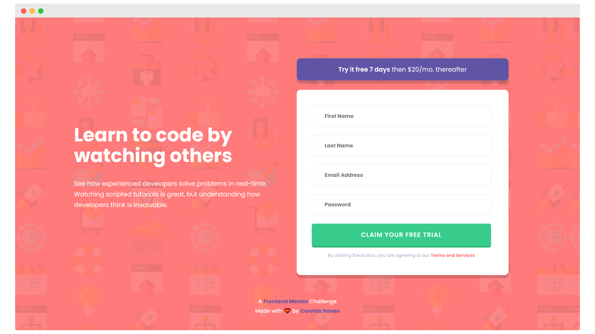

# Frontend Mentor - Intro component with sign up form solution

This is my solution to the [Intro component with sign up form challenge on Frontend Mentor](https://www.frontendmentor.io/challenges/intro-component-with-signup-form-5cf91bd49edda32581d28fd1). Frontend Mentor challenges help you improve your coding skills by building realistic projects.

--------

## TABLE OF CONTENTS

- [Overview](#overview)
  - [The challenge](#the-challenge)
  - [Screenshot](#screenshot)
  - [My solution](#my-solution)
- [My process](#my-process)
  - [Built with](#built-with)
  - [Lessons Learned](#lessons-learned)
  - [Continued development](#continued-development)
  - [Useful resources](#useful-resources)
- [Author](#author)

---

## OVERVIEW

### THE CHALLENGE

Users should be able to:

- View the optimal layout for the site depending on their device's screen size
- See hover states for all interactive elements on the page
- Receive an error message when the `form` is submitted if:
  - Any `input` field is empty. The message for this error should say *"[Field Name] cannot be empty"*
  - The email address is not formatted correctly (i.e. a correct email address should have this structure: `name@host.tld`). The message for this error should say *"Looks like this is not an email"*

### MY SOLUTION

- Solution URL: [Code](https://github.com/SheGeeks/Frontend-Mentor-Projects/tree/Frontend-Mentor-Projects/Signup%20Form)
- Live Site URL: [Live Demo](https://shegeeks.github.io/Frontend-Mentor-Projects/Signup%20Form/)

## MY PROCESS

Started building the mobile design first with Flexbox. Added form using CSS Grid. Moved on to adding responsive styling for desktop view. Lastly, I added client-side validation to the form and a error message with an accompanying image using a combination of CSS & JavaScript.

### BUILT WITH

- HTML5 | Semantic markup
- CSS3 | Flexbox, Media Queries
- JavaScript
- A11Y [1](#fn1)
- Mobile-first workflow
- 💝

### LESSONS LEARNED

 - **Update (4/8/21)**: After receiving feedback from <a href="https://github.com/grace-snow">@grace-snow</a> in the Frontend Mentor Slack channel, my solution is now responsive AF and the error indicators properly adjust with the inputs in all orientations. Grace also introduced me to the `:invalid` psuedo class to easily position the error indicator images correctly.

-  **Update (4/8/21)** I am no longer using CSS Grid on this form.  ~~I always appreciate playing with both Flexbox and CSS Grid in the same designs. Doing so allows me to get a better understanding of the differences and limitations with using either one.~~

- Learned a lot about client-side form validation using JS rather than HTML5 validation features. Felt there was a lot more flexibility with what I could create in this approach, especially with the error messages.

### CONTINUED DEVELOPMENT

- Javascript form validation
- CSS form validation
- A11Y

### USEFUL RESOURCES

- [A11Y Checklist](https://www.a11yproject.com/checklist/)
- [Styling Form Inputs in CSS with `:required`, `:optional`, `:valid` & `:invalid`](https://www.digitalocean.com/community/tutorials/css-styling-form-input-validity)
- [`:invalid` CSS pseudo-class (MDN)](https://developer.mozilla.org/en-US/docs/Web/CSS/:invalid)
- [JavaScript Client-side Form Validation (YouTube)](https://www.youtube.com/watch?v=rsd4FNGTRBw)

## AUTHOR
- Website: [SheGeeks.net](https://shegeeks.net)
- Twitter: [@Corvida](https://www.twitter.com/corvida)
- Frontend Mentor: [@SheGeeks](https://www.frontendmentor.io/profile/shegeeks)

---
<b><a id="fn1">1</a></b>: Colors of the button and terms & services statement do not meet WCAG 2 AA contrast ratio thresholds. These colors are designated in the style guide and necessary to accomplish the goal of the challenge. [↩](#a1)