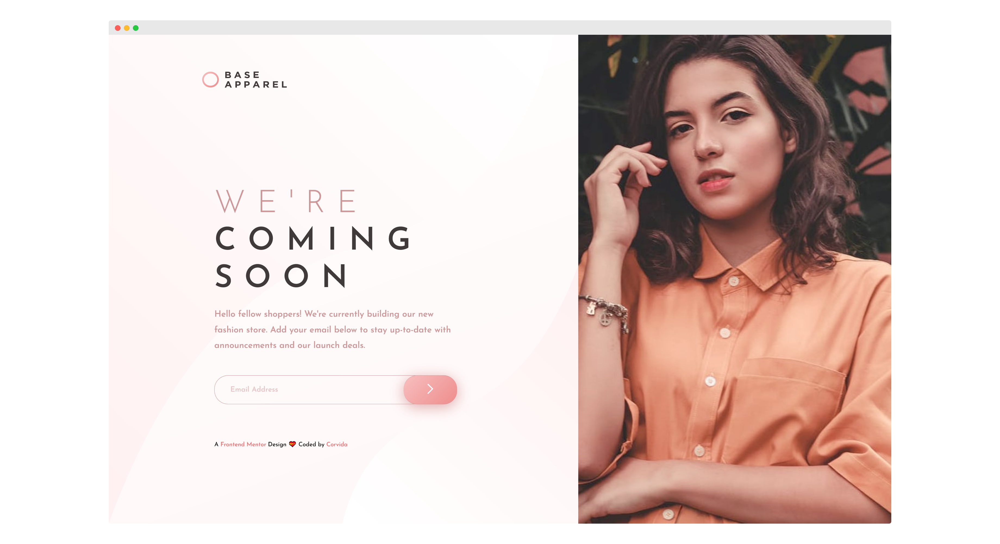

# Frontend Mentor - Base Apparel coming soon page solution

This is my solution to the [Base Apparel coming soon page challenge on Frontend Mentor](https://www.frontendmentor.io/challenges/base-apparel-coming-soon-page-5d46b47f8db8a7063f9331a0).

## Table of contents

- [Overview](#overview)
  - [The challenge](#the-challenge)
  - [Screenshot](#screenshot)
  - [Links](#links)
- [My process](#my-process)
  - [Built with](#built-with)
  - [What I learned](#what-i-learned)
  - [Continued development](#continued-development)
  - [Useful resources](#useful-resources)
- [Author](#author)

## Overview

### The challenge

Users should be able to:

- View the optimal layout for the site depending on their device's screen size
- See hover states for all interactive elements on the page
- Receive an error message when the `form` is submitted if:
  - The `input` field is empty
  - The email address is not formatted correctly

### Screenshot

### Links

- [Frontend Mentor Solution](#)
- [Live Demo](https://shegeeks.github.io/Frontend-Mentor-Projects/base-apparel/)

## My process

### Built with

- HTML5
- CSS3
- Flexbox
- JavaScript
- Mobile-first workflow
- A11Y

### What I learned

This challenge was great practice with using multiple images. I really enjoyed planning this layout the most because there's so many ways to tackle split layouts. I choose to use flexbox on most of the layout for responsiveness and speed. I also experimented with using `picture` to switch the header images on desktop and mobile. In order to be able to clip the image when viewing on a desktop, I did not continue using `picture`. Still, I got a greater understanding of how to use it moving forward.

### Continued development
- JavaScript
- A11Y

### Useful resources
- [W3: `Picture`](https://www.w3schools.com/html/html_images_picture.asp)

## Author

- Tech Blog - [SheGeeks.net](https://shegeeks.net)
- Twitter - [@Corvida](https://www.twitter.com/corvida)
- Frontend Mentor - [@SheGeeks](https://www.frontendmentor.io/profile/shegeeks)