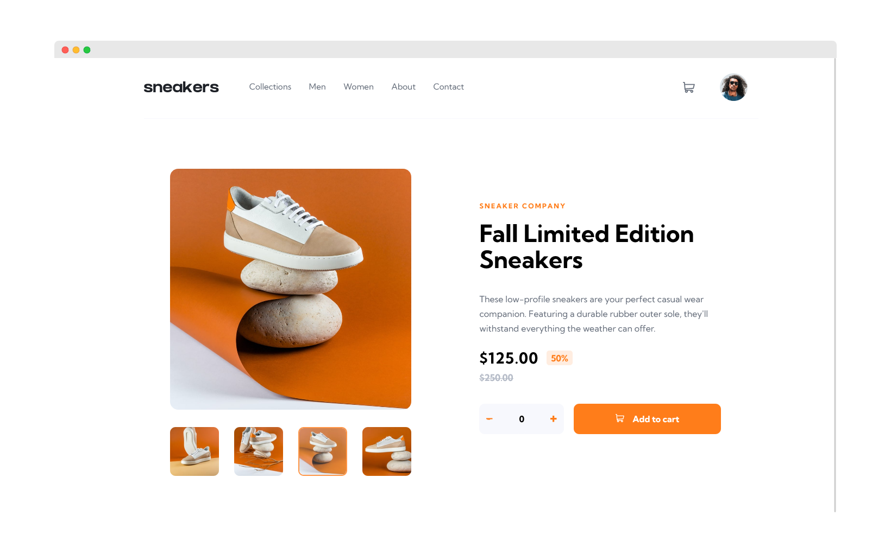

# Frontend Mentor - E-commerce product page solution

This is a solution to the [E-commerce product page challenge on Frontend Mentor](https://www.frontendmentor.io/challenges/ecommerce-product-page-UPsZ9MJp6).

## Table of contents

- [Overview](#overview)
  - [The challenge](#the-challenge)
  - [Screenshot](#screenshot)
  - [Links](#links)
- [My process](#my-process)
  - [Built with](#built-with)
  - [What I learned](#what-i-learned)
  - [Continued development](#continued-development)
  - [Useful resources](#useful-resources)
- [Author](#author)

## Overview

### The challenge

Users should be able to:

- View the optimal layout for the site depending on their device's screen size
- See hover states for all interactive elements on the page
- Open a lightbox gallery by clicking on the large product image
- Switch the large product image by clicking on the small thumbnail images
- Add items to the cart
- View the cart and remove items from it

### Screenshot

### Links

- [Source Code](https://github.com/SheGeeks/Frontend-Mentor-Projects/tree/Frontend-Mentor-Projects/ecommerce-product-page)
- [Live Solution](https://shegeeks.github.io/Frontend-Mentor-Projects/ecommerce-product-page/)

## My process

### Built with

- Mobile-first workflow
- CSS Flexbox & Grid
- JavaScript

### What I learned

This was great practice in pre-planning the layout due to hidden components like the lightbox, checkout cart and mobile menu. Figuring out where to place these items took some time. There was a lot of JavaScript learning with this challenge with respect to all the interactive buttons. I'm not sure if having so many eventListeners is a performance issue even if the code is "correct".

The navigation hover effect for the desktop view was also a learning moment. Getting the hover effect to show-up well below the navigation links took a lot of patience and testing because of the impact on the heading.

I also used more inlined SVGs for the icons rather than wrapping them with images easily style them. Alternatively, the `filter` property was very helpful with minor styling if I wanted to use an SVG as the source for an `img`.

I'm most proud of the JS code I created for toggling the fade effect when switching product images in mobile view. This also took time and tinkering to figure out, but I was pleased when I did.

Bonus: First time using JavaScript to disable an event based on the window size. 😎

### Continued development

- JavaScript performance
- CSS Animations
- Lightbox Modals

### Useful resources

- [CSS Grid Guide](https://css-tricks.com/snippets/css/complete-guide-grid/)
- [Ex. Quantity input](https://www.cssscript.com/demo/number-spinner-quantity-input/)
- [Ex. Shopping cart notification](https://codepen.io/hughker/pen/PzZOQP)
- [Toggling Visibility (a11y)](https://css-tricks.com/snippets/css/toggle-visibility-when-hiding-elements/)
- [Tutorial: Create A Shopping Cart UI](https://uxplanet.org/how-to-create-a-shopping-cart-ui-using-html-css-e5db3cd55aa0)
- [JS Lightbox Modal (FreeCodeCamp)](https://codepen.io/rdev-rocks/pen/KXNzvo)

## Author

- [Portfolio](https://corvida.netlify.app/)
- [Tech Blog](https://shegeeks.net)
- [@Corvida on Twitter](https://www.twitter.com/corvida)
- [@SheGeeks on Frontend Mentor](https://www.frontendmentor.io/profile/shegeeks)
