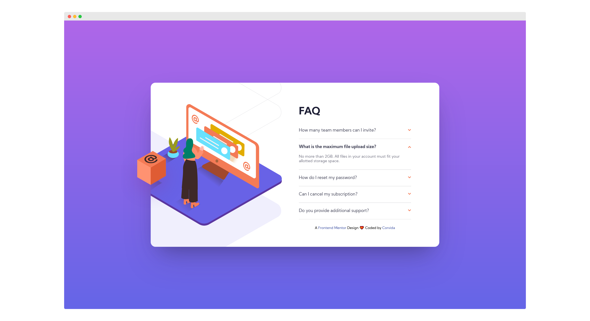

# Frontend Mentor - FAQ accordion card solution

This is my solution to the [FAQ accordion card challenge on Frontend Mentor](https://www.frontendmentor.io/challenges/faq-accordion-card-XlyjD0Oam).

## Table of contents

- [Overview](#overview)
  - [The challenge](#the-challenge)
  - [Screenshot](#screenshot)
  - [Links](#links)
- [My process](#my-process)
  - [Built with](#built-with)
  - [What I learned](#what-i-learned)
  - [Continued development](#continued-development)
  - [Useful resources](#useful-resources)
- [Author](#author)

## Overview

### The challenge

Users should be able to:

- View the optimal layout for the component depending on their device's screen size
- See hover states for all interactive elements on the page
- Hide/Show the answer to a question when the question is clicked

### Screenshot

### Links

- [Frontend Mentor Solution](#)
- [Live Demo](https://shegeeks.github.io/Frontend-Mentor-Projects/faq-accordion-card/)

## My process

### Built with

- Semantic HTML5 markup
- CSS3 
- Flexbox
- Mobile-first workflow
- A11Y

### What I learned

This was challenge was great practice with using multiple backgrounds, positioning properties, and creating an accessible accordian. With accessibility top of mind, I leveraged W3's design pattern example for an accessible accordian to create my own, mainly their JavaScript code. While coding the HTML and CSS was a breeze. I had a lot of fun working with mutiple backgrounds in this project. JavaScript was a lot more challenging than I anticipated. W3 really came to the rescue for that part.

### Continued development
- JavaScript
- A11Y
- CSS Position

### Useful resources
- [W3: Accessible Accordion Example](https://www.w3.org/TR/wai-aria-practices-1.1/examples/accordion/accordion.html)

## Author

- Website - [SheGeeks.net](https://shegeeks.net)
- Twitter - [@Corvida](https://www.twitter.com/corvida)
- Frontend Mentor - [@SheGeeks](https://www.frontendmentor.io/profile/shegeeks)
