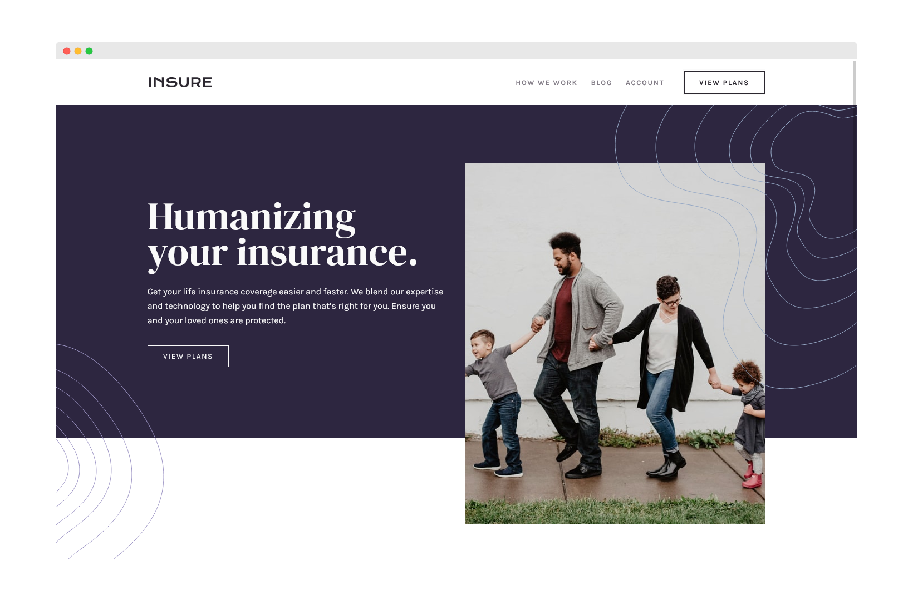

# Frontend Mentor - Insure landing page solution

This is a solution to the [Insure landing page challenge on Frontend Mentor](https://www.frontendmentor.io/challenges/insure-landing-page-uTU68JV8).

## Table of contents

- [Overview](#overview)
  - [The challenge](#the-challenge)
  - [Screenshot](#screenshot)
  - [Links](#links)
- [My process](#my-process)
  - [Built with](#built-with)
  - [What I learned](#what-i-learned)
  - [Useful resources](#useful-resources)
- [Author](#author)

## Overview

### The challenge

Users should be able to:

- View the optimal layout for the site depending on their device's screen size
- See hover states for all interactive elements on the page

### Screenshot

### Links

- [Solution](https://github.com/SheGeeks/Frontend-Mentor-Projects/tree/Frontend-Mentor-Projects/insure-landing-page)
- [Live Site](https://shegeeks.github.io/Frontend-Mentor-Projects/insure-landing-page/)

## My process

### Built with

- Mobile-first workflow
- Semantic HTML5 markup
- Flexbox
- JavaScript (mobile navigation only)

### What I learned

Another great exercise in using multiple background images. I do wonder if it'll ever get any easier. After completing this challenge, I feel a lot more knowledgeable about how they work, especially when it comes to placement on top of another element and in or out of a div container.

I also learned how to work with repsonsive images using the `picture` tag, which was very convenient for this challenge.

### Useful resources

- [MDN Web Docs: Responsive images](https://developer.mozilla.org/en-US/docs/Learn/HTML/Multimedia_and_embedding/Responsive_images) - Always a helpful reminder on how responsive images work and another way to implement image switching across screen sizes when the images are the same.

## Author

- [Tech Blog](https://shegeeks.net)
- [Dev Portfolio](https://corvida.netlify.app/)
- [@Corvida on Twitter](https://www.twitter.com/corvida)
- [@SheGeeks on Frontend Mentor](https://www.frontendmentor.io/profile/shegeeks)
