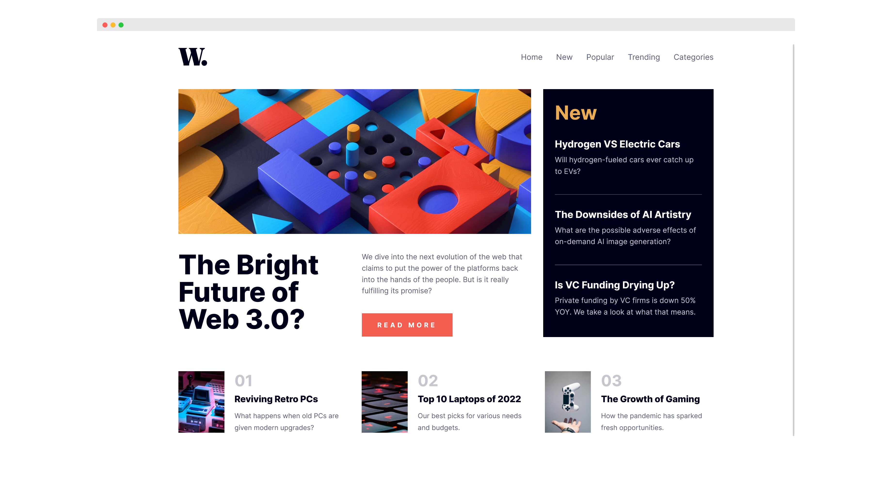

# Frontend Mentor - News homepage

## Table of contents

- [Overview](#overview)
  - [The challenge](#the-challenge)
  - [Screenshot](#screenshot)
  - [Links](#links)
- [My process](#my-process)
  - [Built with](#built-with)
  - [What I learned](#what-i-learned)
  - [Helpful resources](#useful-resources)
- [Author](#author)

## Overview

### The challenge

Users should be able to:

- View the optimal layout depending on their device's screen size
- See hover and focus states for interactive elements

### Screenshot

### Links

- [Solution](https://github.com/SheGeeks/Frontend-Mentor-Projects/tree/Frontend-Mentor-Projects/news-homepage)
- [Live Site](https://shegeeks.github.io/Frontend-Mentor-Projects/news-homepage/)

## My process

### Built with

- Semantic HTML5
- Accessibile mobile menu
- Responsive & Mobile Ready
- CSS Grid

### What I learned

This challenge reminded me of how powerful CSS Grid is, especially for complex layouts like this. Using Grid made this ridiculously easy to setup for desktop and mobile devices.

### Helpful resources

- [Web Acessibility: Mobile Menus](https://w3c.github.io/wai-mobile-intro/mobile/mobile-menus/)

## Author

- [Portfolio](https://corvida.netlify.app/)
- [Tech Blog](https://shegeeks.net)
- [@Corvida on Twitter](https://www.twitter.com/corvida)
- [@SheGeeks on Frontend Mentor](https://www.frontendmentor.io/profile/shegeeks)
