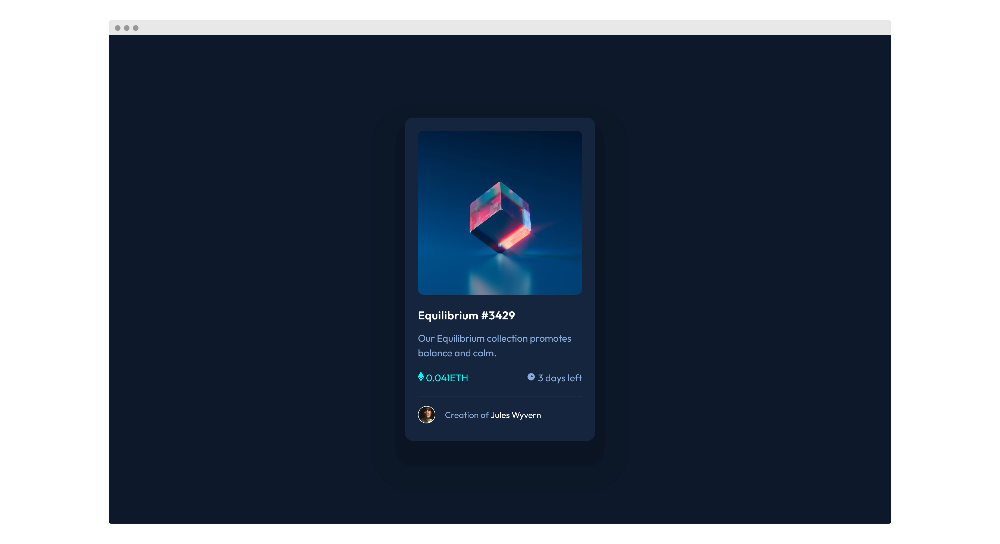

# Frontend Mentor - NFT preview card component solution

This is a solution to the [NFT preview card component challenge on Frontend Mentor](https://www.frontendmentor.io/challenges/nft-preview-card-component-SbdUL_w0U).

## Table of contents

- [Overview](#overview)
  - [The challenge](#the-challenge)
  - [Screenshot](#screenshot)
  - [Links](#links)
- [My process](#my-process)
  - [Built with](#built-with)
  - [What I learned](#what-i-learned)
  - [Acknowledgments](#acknowledgments)
- [Author](#author)

## Overview

### The challenge

Users should be able to:

- View the optimal layout depending on their device's screen size
- See hover states for interactive elements

### Screenshot

### Links

- [Solution](https://github.com/SheGeeks/Frontend-Mentor-Projects/tree/Frontend-Mentor-Projects/nft-preview-card)
- [Live Site](https://shegeeks.github.io/Frontend-Mentor-Projects/nft-preview-card/)

## My process

### Built with

- Mobile-first workflow
- Semantic HTML5 markup
- CSS3 / Flexbox

### What I learned

Took on this challenge as practice for centering containers (or cards in this case). Always appreciate a simple challenege to practice the basics. Also, got a better understanding of how each value of `box-shadow` impacts its look during this challenge.

### Acknowledgments

Was reminded of a [helpful comment on one of my previous solutions](https://www.frontendmentor.io/solutions/single-price-grid-component-css-grid-lxnu2Mk40) and want to acknowledge how awesome using `min-height` is to avoid cutting off centered content in portrait and landscape viewing on mobile devices.

## Author

- [Tech Blog](https://shegeeks.net)
- [Dev Portfolio](https://corvida.netlify.app/)
- [@Corvida on Twitter](https://www.twitter.com/corvida)
- [@SheGeeks on Frontend Mentor](https://www.frontendmentor.io/profile/shegeeks)
