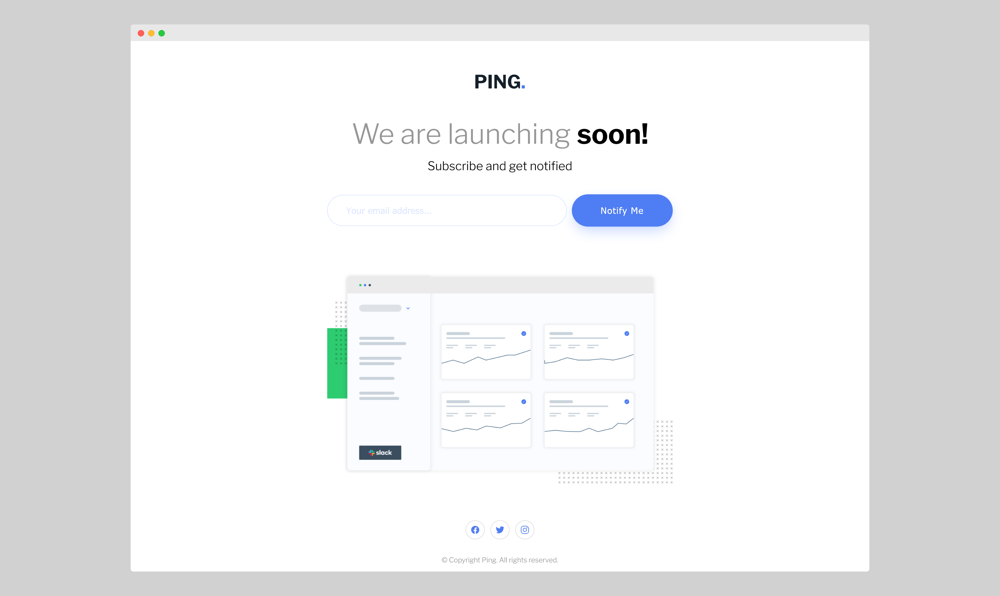

# Frontend Mentor - Ping coming soon page solution

This is my solution to the [Ping coming soon page challenge on Frontend Mentor](https://www.frontendmentor.io/challenges/ping-single-column-coming-soon-page-5cadd051fec04111f7b848da). Frontend Mentor challenges help you improve your coding skills by building realistic projects. 

## Table of contents

- [Overview](#overview)
  - [The challenge](#the-challenge)
  - [Screenshot](#screenshot)
  - [Links](#links)
- [My process](#my-process)
  - [Built with](#built-with)
  - [What I learned](#what-i-learned)
  - [Continued development](#continued-development)
  - [Useful resources](#useful-resources)
- [Author](#author)

## Overview

### The challenge

Users should be able to:

- View the optimal layout for the site depending on their device's screen size
- See hover states for all interactive elements on the page
- Submit their email address using an `input` field
- Receive an error message when the `form` is submitted if:
	- The `input` field is empty. The message for this error should say *"Whoops! It looks like you forgot to add your email"*
	- The email address is not formatted correctly (i.e. a correct email address should have this structure: `name@host.tld`). The message for this error should say *"Please provide a valid email address"*

### Screenshot

### Links

- [Frontend Mentor Solution]()
- [Live Demo](https://shegeeks.github.io/Frontend-Mentor-Projects/ping-coming-soon-page/)

## My process

### Built with

- HTML5
- CSS3
- Flexbox
- Mobile first workflow
- A11Y

### What I learned

Started with a mobile first workflow, then uickly structured the provided content with HTML and styled with CSS for mobile layout. This design was great practice for styling SVG graphics and making accessible forms. One thing I tried and succeeded at with this challenge was using CSS only for client-side validation error. 

### Continued development
- SVG graphics
- Accessibility
- Form validation and errors

### Useful resources
- [Beautiful CSS box-shadow examples](https://getcssscan.com/css-box-shadow-examples)
- [Using SVG Images in Web Development](https://medium.com/@tyler.greason/using-svg-images-in-web-development-3da83165aa92)
- [Creating Accessible Forms](https://webaim.org/techniques/forms/controls#input)

## Author

- Website - [Corvida Raven](https://shegeeks.net)
- Frontend Mentor - [@SheGeeks](https://www.frontendmentor.io/profile/shegeeks)
- Twitter - [@Corvida](https://www.twitter.com/corvida)