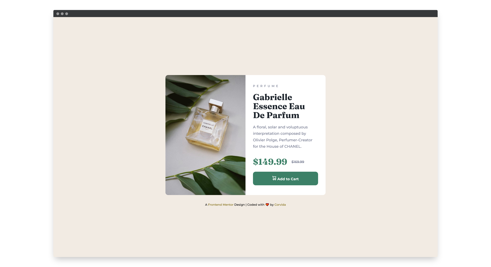

# Frontend Mentor - Product preview card component solution

## Table of contents

- [Overview](#overview)
  - [The challenge](#the-challenge)
  - [Screenshot](#screenshot)
  - [Links](#links)
- [My process](#my-process)
  - [Built with](#built-with)
  - [What I learned](#what-i-learned)
  - [Helpful resources](#useful-resources)
- [Author](#author)

## Overview

### The challenge

Users should be able to:

- View the optimal layout depending on their device's screen size
- See hover and focus states for interactive elements

### Screenshot

### Links

- [Solution](https://github.com/SheGeeks/Frontend-Mentor-Projects/tree/Frontend-Mentor-Projects/product-preview-card)
- [Live Site](https://shegeeks.github.io/Frontend-Mentor-Projects/product-preview-card/)

## My process

### Built with

- Semantic HTML5
- Responsive & Mobile Ready
- Flexbox
- Intrinsic Design (media-query free)

### What I learned

For this component I focused on creating an instrinsic layout for this component, reducing the need for media queries and allowing the design to respond fluidly to various screen sizes.

I'm proud to have accomplished this. However, things get tricky when accounting for flexible padding/margins, which I chose not to dive into with this component. _If it ain't broke, don't fix it._ The simplicity of the code works well across different screens.

### Helpful resources

- [Designing Intrinsic Layouts](https://vimeo.com/380795929) by Jenn Simmons

## Author

- [Portfolio](https://corvida.netlify.app/)
- [Tech Blog](https://shegeeks.net)
- [@Corvida on Twitter](https://www.twitter.com/corvida)
- [@SheGeeks on Frontend Mentor](https://www.frontendmentor.io/profile/shegeeks)
