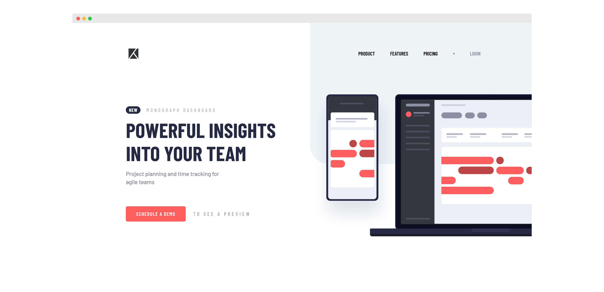

# Frontend Mentor - Project tracking intro component solution

This is a solution to the [Project tracking intro component challenge on Frontend Mentor](https://www.frontendmentor.io/challenges/project-tracking-intro-component-5d289097500fcb331a67d80e). Frontend Mentor challenges help you improve your coding skills by building realistic projects. 

## Table of contents

- [Overview](#overview)
  - [The challenge](#the-challenge)
  - [Screenshot](#screenshot)
  - [Links](#links)
- [My process](#my-process)
  - [Built with](#built-with)
  - [What I learned](#what-i-learned)
  - [Continued development](#continued-development)
  - [Useful resources](#useful-resources)
- [Author](#author)

## Overview

### The challenge

Users should be able to:

- View the optimal layout for the site depending on their device's screen size
- See hover states for all interactive elements on the page
- Create the background shape using code

### Screenshot

### Links

- [Solution](https://github.com/SheGeeks/Frontend-Mentor-Projects/tree/Frontend-Mentor-Projects/project-tracking-component)
- [Demo](https://shegeeks.github.io/Frontend-Mentor-Projects/project-tracking-component/)

## My process

### Built with

- Semantic HTML5 markup
- CSS3
- Flexbox
- Mobile-first workflow
- Responsive Design
- Media Queries
- Javascript

### What I learned

To start, I'm getting better with creating layouts! 🤓 This one took less than an hour to put together. More time spent on positioning images and creating background shape than putting together the layout. This project provided great reinforcement of position properties for elements and background images in CSS.

There was a lot to unpack for the desktop portion of this challenge after starting with a mobile-first workflow. One way I enjoyed tackling the transition is by using Firefox DevTools to prototype any changes within the browser, then copying the code back to my editor (VS Code). This helped reduce feeling overwhelmed by untangling the more exhaustive parts of my CSS.

### Feedback Request

This challenge has really piqued my interest in digging deeper into different ways to position layouts. Any resources that were helpful to you around this topic would greatly appreciated!

### Continued development

More practice on posiitioning elements to get faster and comfortable with doing so. Also intend to work on using responsive typography within these projects. I usually don't becase I'm so focused on trying to get the exact design. It's tedious and nearly impossible to calculate how things will look beyond the challenge's breakpoints. 

In the future, I think I will still continue to getting an exact match with the design and start converting pixel values into their corresponding responsive units. What I hope to accomplish with this is design accuracy at the challenge breakpoints, while still allowing the flexibility of a fulyl responsive design.

At some point in the future I may come back to this project to do more code cleanup in the stylesheet. There were a lot of properties to work with, especially for the mobile menu and just looking at the stylesheet for this project feels overwhelming. 😩 Still proud of myself for getting this done in 2 days. 

### Useful resources

- [How to design with CSS shapes: An introduction](https://www.creativebloq.com/how-to/design-with-css-shapes) - Referenced for creating light grey background shape.

- [Responsive Nav](https://www.w3schools.com/howto/howto_js_topnav_responsive.asp) - Because you don't need to know it all. You just need to know what you need to know.

## Author
- Website - [Corvida Raven](https://shegeeks.net)
- Frontend Mentor - [@SheGeeks](https://www.frontendmentor.io/profile/shegeeks)
- Twitter - [@Corvida](https://www.twitter.com/corvida)
