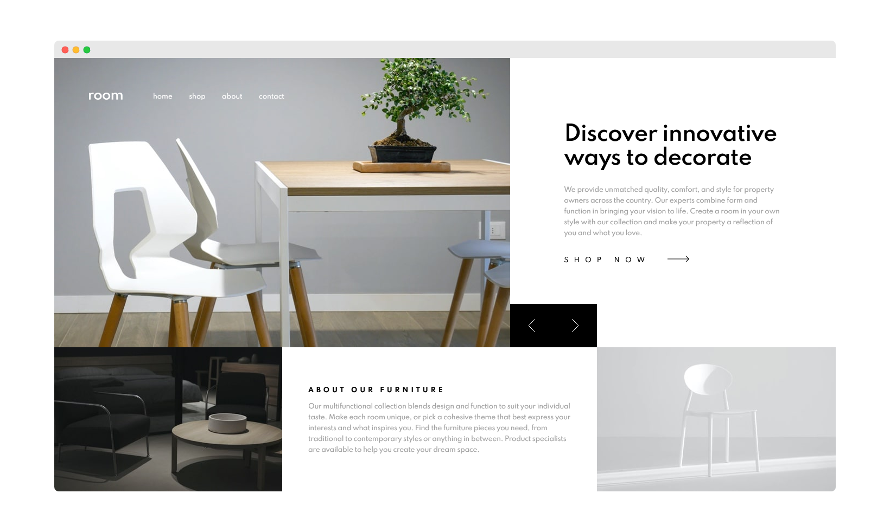

# Frontend Mentor - Room homepage solution

This is a solution to the [Room homepage challenge on Frontend Mentor](https://www.frontendmentor.io/challenges/room-homepage-BtdBY_ENq).

## Table of contents

- [Overview](#overview)
  - [The challenge](#the-challenge)
  - [Screenshot](#screenshot)
  - [Links](#links)
- [My process](#my-process)
  - [Built with](#built-with)
  - [What I learned](#what-i-learned)
  - [Continued development](#continued-development)
  - [Useful resources](#useful-resources)
- [Author](#author)

## Overview

### The challenge

Users should be able to:

- View the optimal layout for the site depending on their device's screen size
- See hover states for all interactive elements on the page
- Navigate the slider using either their mouse/trackpad or keyboard

### Screenshot

### Links

- [Live Site](https://shegeeks.github.io/Frontend-Mentor-Projects/room-homepage/)
- [My Code](https://github.com/SheGeeks/Frontend-Mentor-Projects/tree/Frontend-Mentor-Projects/room-homepage)

## My process

### Built with

- Mobile-first
- CSS3
- CSS Custom Properties
- Flexbox
- JavaScript

### What I learned

About halfway through working on this, it dawned on me that I could've used CSS Grid instead of Flexbox to save myself some time.

I also wish I would've planned a little better for applying DRY HTML to the shop now section, but once I style the layout close to perfection I don't like to alter the structure of the HTML. Lesson learned, but I may take some time in a few weeks to correct this.

Was brave enough to use `clamp()` on the heading font, which I really enjoyed the result of and will try to incorporate more in the future.

Also, I always love an opportunity to use `picture` for responsive images and enjoyed the challenge of combining this with a slider.

### Continued development

- Applying DRY principles and doing better planning beforehand to save myself a lot of time.

- Accessibility: I'm pretty sure this isn't the most accessible code and I want to improve that.

- Animations: Will add a few animations in the near future.

- `Clamp()`: Researching if this can be used on padding/margins.

### Useful resources

- [`Clamp()` (MDN)](<https://developer.mozilla.org/en-US/docs/Web/CSS/clamp()>)

## Author

- [Portfolio](https://corvida.netlify.app/)
- [Tech Blog](https://shegeeks.net)
- [@Corvida on Twitter](https://www.twitter.com/corvida)
- [@SheGeeks on Frontend Mentor](https://www.frontendmentor.io/profile/shegeeks)
