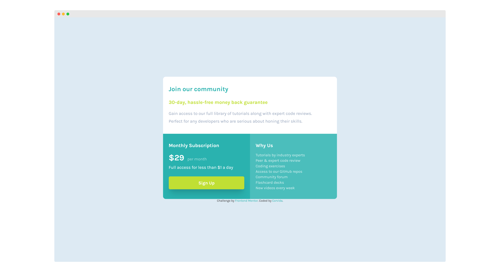

# Frontend Mentor - Single price grid component solution

This is a solution to the [Single price grid component challenge on Frontend Mentor](https://www.frontendmentor.io/challenges/single-price-grid-component-5ce41129d0ff452fec5abbbc).

## Table of contents

- [Overview](#overview)
  - [The challenge](#the-challenge)
  - [Screenshot](#screenshot)
  - [Links](#links)
- [My process](#my-process)
  - [Built with](#built-with)
  - [What I learned](#what-i-learned)
  - [Continued development](#continued-development)
  - [Useful resources](#useful-resources)
- [Author](#author)

## Overview

### The challenge

Users should be able to:

- View the optimal layout for the component depending on their device's screen size
- See a hover state on desktop for the Sign Up call-to-action

### Screenshot

### Links

- [Solution](https://github.com/SheGeeks/Frontend-Mentor-Projects/tree/Frontend-Mentor-Projects/single-price-grid-component)
- [Live Demo](https://shegeeks.github.io/Frontend-Mentor-Projects/single-price-grid-component/)

## My process

### Built with

- CSS Grid
- A11Y
- Mobile-first workflow
- HTML5 Semantic Markup

### What I learned

This is my first frontend mentor challenge built almost entirely with CSS Grid. I do wish there was an easy way to center a grid container horizontally and veritcally without using flexbox. If you know of a way that could work with my solution, let me know!

Used grid-areas and grid-templates to create this layout in no time for mobile and desktop. CSS Grid made this challenge a breeze. I may go back and code it using Flexbox just to see if that changes the difficulty for me.

### Continued development

Using CSS Grid more. I really feel Grid might be easier to work with over Flexbox in some cases, espeically for responsive design.

### Useful resources

- [Understanding CSS Grid Template Areas](https://www.smashingmagazine.com/understanding-css-grid-template-areas/)
- [CSS Box Shadow Examples](https://getcssscan.com/css-box-shadow-examples)

## Author

- Tech Blog - [SheGeeks.net](https://shegeeks.net)
- Portfolio - [Corvida's Dev Portfolio](https://corvida.netlify.app/)
- Twitter - [@Corvida](https://www.twitter.com/corvida)
- Frontend Mentor - [@SheGeeks](https://www.frontendmentor.io/profile/shegeeks)
