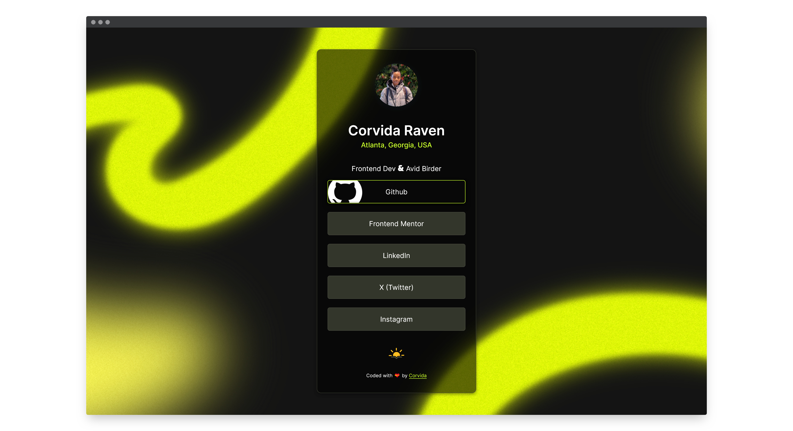
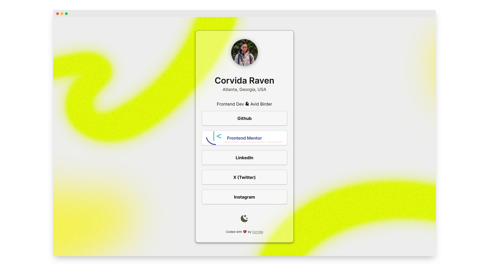

# Frontend Mentor - News homepage

## Table of contents

- [Overview](#overview)
  - [The challenge](#the-challenge)
  - [My solution](#solution)
  - [Links](#links)
- [My process](#my-process)
  - [Built with](#built-with)
  - [What I learned](#what-i-learned)
  - [Helpful resources](#useful-resources)
- [Author](#author)

## Overview

### The challenge

Users should be able to:

- See hover and focus states for all interactive elements on the page

### My solution

### Links

- [Solution](https://github.com/SheGeeks/Frontend-Mentor-Projects/tree/Frontend-Mentor-Projects/social-links-card)
- [Live Demo](https://shegeeks.github.io/Frontend-Mentor-Projects/social-links-card/)

## My process

### Built with

- Semantic HTML5
- CSS Flexbox
- A lot of 💝

### What I learned

Had so much fun adding the hover effects for this challenge and playing with different settings to land on the current styling. I'm especially proud of the squiggly line added to the Frontend Mentor link. Since this challenge defaulted to a dark theme, I added a light theme and toggle to access both themes.

### Helpful resources

- [Adding dark mode](https://www.ditdot.hr/en/dark-mode-website-tutorial)
- [CSS Box-shadow code snippets](https://getcssscan.com/css-box-shadow-examples)
- Icons: [Meteocons](https://bas.dev/work/meteocons)

## Author

- [Dev Portfolio](https://dev.shegeeks.net/)
- [Tech Blog](https://shegeeks.net)
- [@Corvida on Twitter](https://www.twitter.com/corvida)
- [@SheGeeks on Frontend Mentor](https://www.frontendmentor.io/profile/shegeeks)
