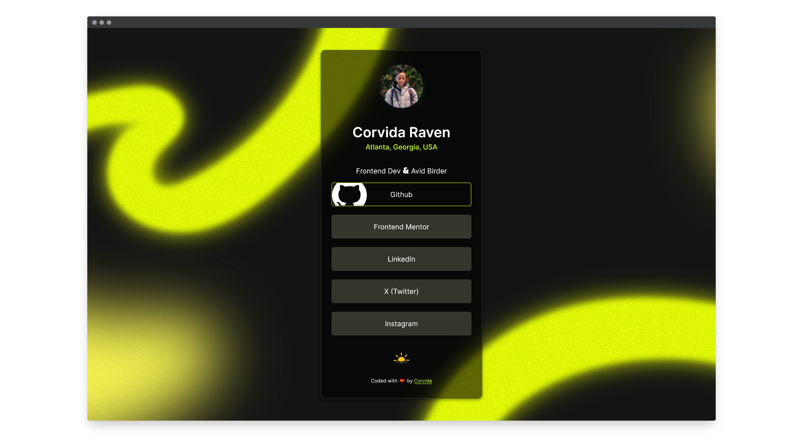
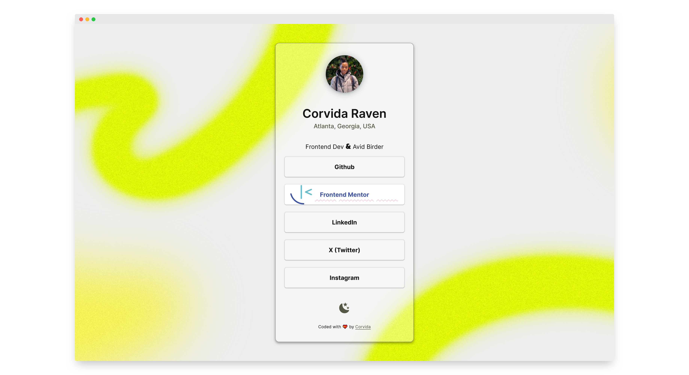

# Social Links Profile (A React/Next.js Project)

## Table of contents

- [Overview](#overview)
- [My process](#my-process)
  - [Built with](#built-with)
  - [What I learned](#what-i-learned)
  - [Helpful resources](#useful-resources)
- [Contact](#contact)

## Overview

- [Live Demo](https://vidasocials.netlify.app/)
- [Solution](https://github.com/SheGeeks/Frontend-Mentor-Projects/tree/Frontend-Mentor-Projects/social-links-react)

## My process

### Built with

- Next.js/React
- Typescript
- Tailwind CSS
- A lot of 💝

### What I learned

I successfully "converted" this challenge from HTML, CSS and a little JavaScript into a React app built with Next.js and Tailwind CSS. I'm most proud of adding a light theme to complement the default dark styling of this challenge and a toggle to move between both themes. Using animated icons for the theme toggle was another favorite addition.

It was a challenge getting the animated toggle icons for each theme to restart their animation when clicked and without causing errors. Creating dynamic URLs for the icons forces the animation to restart when toggling. However, common methods for creating a dynamic URL, like using the date and time, caused discrepancies between server and client file names and would throw an error.

So, I'm using a count variable equal to 0 and increasing it by 1 when the toggle button is clicked. This allows me to create dynamic URLs for each theme's toggle icon and ensure the filenames match across client and server.

### Helpful resources

- Icons: [Meteocons](https://bas.dev/work/meteocons)

## Contact

- [Dev Portfolio](https://dev.shegeeks.net/)
- [Tech Blog](https://shegeeks.net)
- [@Corvida on Twitter](https://www.twitter.com/corvida)
- [@SheGeeks on Frontend Mentor](https://www.frontendmentor.io/profile/shegeeks)
