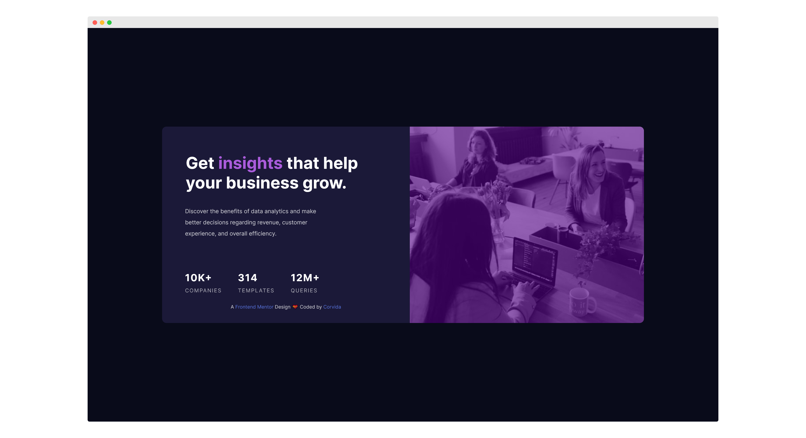

# Frontend Mentor - Stats preview card component solution

This is my solution to the [Stats preview card component challenge on Frontend Mentor](https://www.frontendmentor.io/challenges/stats-preview-card-component-8JqbgoU62).

## Table of contents

- [Overview](#overview)
  - [The challenge](#the-challenge)
  - [Screenshot](#screenshot)
  - [Links](#links)
- [My process](#my-process)
  - [Built with](#built-with)
  - [What I learned](#what-i-learned)
  - [Continued development](#continued-development)
  - [Useful resources](#useful-resources)
- [Author](#author)

## Overview

### The challenge

Users should be able to:

- View the optimal layout for the component depending on their device's screen size

### Screenshot

### Links

- [Frontend Mentor Solution](https://www.frontendmentor.io/solutions/responsive-stats-preview-card-c4O935rw3)
- [Live Demo](https://shegeeks.github.io/Frontend-Mentor-Projects/stats-preview-card/)

## My process

### Built with

- Semantic HTML5 markup
- CSS3
- Flexbox
- Mobile-first workflow
- A11Y

### What I learned

Since I've been working on more challenging web development projects lately, this one felt very easy. For once, I felt my _progress_ in web development while coding, which was a very nice feeling.

I ran into my biggest challenge when positioning the desktop featured image. I was initially able to switch the image position responsively. However, the image would move to the left instead of the right side of the card. Great opportunity to learn more about how `flex-flow`, `flex-wrap`, and `flex-direction` work.

I also realized that working from the mobile design first is great, but it's also good to be aware of how the layout will change for desktop. Taking the time to review the desktop design before starting the mobile design could've prevented my featured image mistep and saved me from backtracking on other parts of my code.

### Continued development

- Flexbox
- Design Systems

### Useful resources

No additional resources used for this project. _(A first!)_

## Author

- Website - [SheGeeks.net](https://shegeeks.net)
- Twitter - [@Corvida](https://www.twitter.com/corvida)
- Frontend Mentor - [@SheGeeks](https://www.frontendmentor.io/profile/shegeeks)
