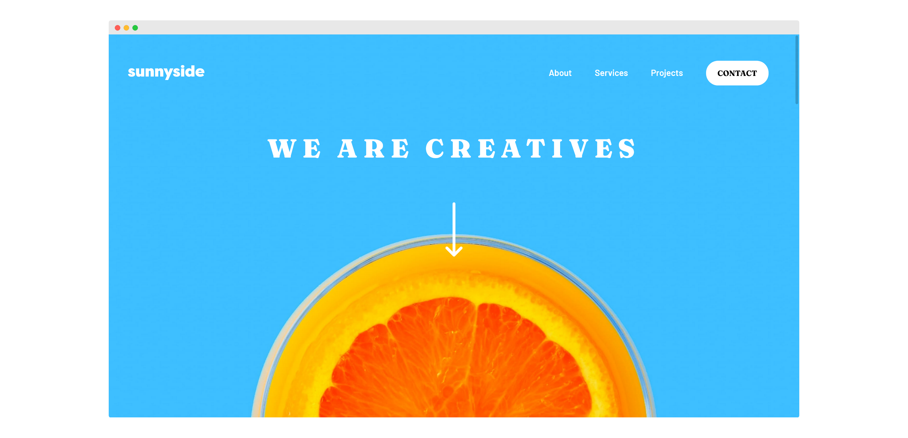

# Frontend Mentor - Sunnyside agency landing page solution

This is a solution to the [Sunnyside agency landing page challenge on Frontend Mentor](https://www.frontendmentor.io/challenges/sunnyside-agency-landing-page-7yVs3B6ef). 

## Table of contents

- [Overview](#overview)
  - [The challenge](#the-challenge)
  - [Screenshot](#screenshot)
  - [Links](#links)
- [My process](#my-process)
  - [Built with](#built-with)
  - [What I learned](#what-i-learned)
  - [Continued development](#continued-development)
  - [Useful resources](#useful-resources)
- [Author](#author)

## Overview

### The challenge

Users should be able to:

- View the optimal layout for the site depending on their device's screen size
- See hover states for all interactive elements on the page

### Screenshot

### Links

- [Frontend Mentor Solution](https://www.frontendmentor.io/solutions/mobilefirst-and-accessible-base-apparel-coming-soon-page-5IxXamMSS)
- [Live Demo](https://shegeeks.github.io/Frontend-Mentor-Projects/base-apparel/)

## My process

### Built with

- HTML5
- CSS3
- Flexbox
- JavaScript
- Mobile-first workflow

### What I learned

Another good challenge that `picture` was very useful for since multiple images were given for desktop and mobile. The trickest part of this layout for me was adding the little triangle to the corner of the mobile menu. First time doing something like this. Would love feedback on the approach I took using `position` and `border` to accomplish that portion of the design. 

I used Flexbox for this challenge, but I think grid would've been a great choice to keep all boxes at equal heights. This was difficult to accomplish with flexbox.

### Continued development

- JavaScript (mobile navigations)
- CSSGrid

### Useful resources

- [W3: `Picture`](https://www.w3schools.com/html/html_images_picture.asp)
- [Cut Corners With Pure CSS](https://www.w3docs.com/snippets/css/how-to-cut-corners-with-pure-css.html)

## Author

- Tech Blog - [SheGeeks.net](https://shegeeks.net)
- Twitter - [@Corvida](https://www.twitter.com/corvida)
- Frontend Mentor - [@SheGeeks](https://www.frontendmentor.io/profile/shegeeks)