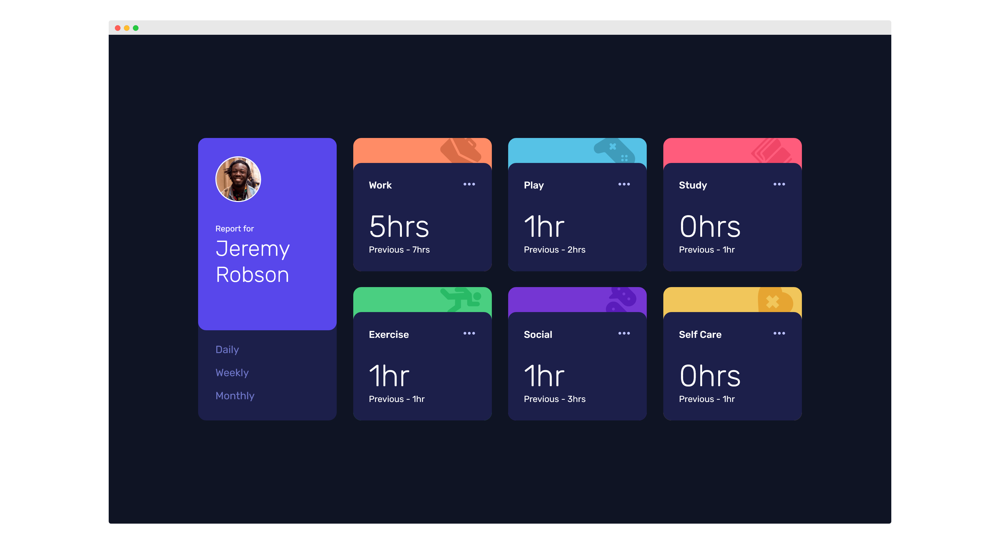

# Frontend Mentor - Time tracking dashboard solution

This is a solution to the [Time tracking dashboard challenge on Frontend Mentor](https://www.frontendmentor.io/challenges/time-tracking-dashboard-UIQ7167Jw).

## Table of contents

- [Overview](#overview)
  - [The challenge](#the-challenge)
  - [Screenshot](#screenshot)
  - [Links](#links)
- [My process](#my-process)
  - [Built with](#built-with)
  - [What I learned](#what-i-learned)
  - [Continued development](#continued-development)
- [Author](#author)

## Overview

### The challenge

Users should be able to:

- View the optimal layout for the site depending on their device's screen size
- See hover states for all interactive elements on the page
- Switch between viewing Daily, Weekly, and Monthly stats

### Screenshot

### Links

- [Live Solution](https://shegeeks.github.io/Frontend-Mentor-Projects/time-tracking-dashboard/)
- [My Code](https://github.com/SheGeeks/Frontend-Mentor-Projects/tree/Frontend-Mentor-Projects/time-tracking-dashboard)

## My process

### Built with

- Semantic HTML5 markup
- CSS Grid
- JavaScript
- Mobile-first workflow

### What I learned

This was a great challenge to practice using CSS Grid, which is a lot of fun when using template areas. Really enjoyed the challenge of creating the layered card designs and adding the accents. Also, I learned which property to use when needing to change the hover color for SVG that's not inlined (hint: it's `filter`).

At first, I was a little stumped about how to approach switching the stats according to which link was clicked, but I figured it out and created little helper functions to keep my code DRY. Lastly, I think this is the first time I've used `foreach` in JavaScript that didn't involve a tutorial and truly grasped what the hell I was doing. Progress.

### Continued development

- CSS Grid
- Javascript

## Author

- [Portfolio](https://corvida.netlify.app/)
- [Tech Blog](https://shegeeks.net)
- [@Corvida on Twitter](https://www.twitter.com/corvida)
- [@SheGeeks on Frontend Mentor](https://www.frontendmentor.io/profile/shegeeks)
