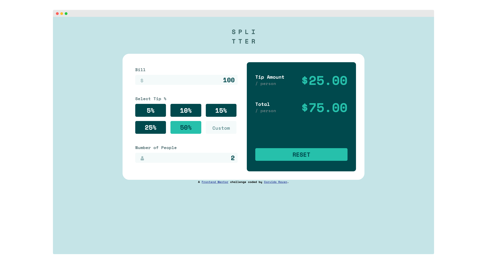

# Frontend Mentor - Tip calculator app solution

This is a solution to the [Tip calculator app challenge on Frontend Mentor](https://www.frontendmentor.io/challenges/tip-calculator-app-ugJNGbJUX).

## Table of contents

- [Overview](#overview)
  - [The challenge](#the-challenge)
  - [Screenshot](#screenshot)
  - [Links](#links)
- [My process](#my-process)
  - [Built with](#built-with)
  - [What I learned](#what-i-learned)
  - [Continued development](#continued-development)
  - [Useful resources](#useful-resources)
- [Author](#author)

## Overview

### The challenge

Users should be able to:

- View the optimal layout for the app depending on their device's screen size
- See hover states for all interactive elements on the page
- Calculate the correct tip and total cost of the bill per person

### Screenshot



### Links

- [CODE](https://github.com/SheGeeks/Frontend-Mentor-Projects/tree/Frontend-Mentor-Projects/tip-calculator)
- [DEMO](https://shegeeks.github.io/Frontend-Mentor-Projects/tip-calculator/)

## My process

### Built with

- Mobile-first workflow
- CSS3
- Flexbox
- JavaScript
- Responsive

### What I learned

This was a great template to practice what I'm learning from a JavaScript course. I learned a lot about adding Event Listeners to different inputs and mixing in keypress events to update the totals for the calculator on the fly. I'm probably most proud of the code for the toggle effect, specifically getting it to work on the custom input regardless of whether you click the input or around it:

```
container.addEventListener("click", (e) => {
  let perSelected = document.querySelector(".percent.selected");

  // Selected Tip Toggle
  if (e.target.classList.contains("percent") || e.target === customTipInput) {
    if (perSelected) perSelected.classList.remove("selected");
    e.target.classList.toggle("selected");
    selectedTip = e.target.getAttribute("percentage");

    //select custom tip from input
    if (e.target === customTipInput) {
      selectedTip = customTipInput.value;
      document.querySelector(".percent.custom").classList.toggle("selected");
    }
  }
  calcTotals();
});
```

This went through many stages of refactoring, but I did get stuck on removing the perSelected variable and still having this block work properly. Any feedback on this block is greatly appreciated!

One of my favorite additions to this code was a piece that prevents a negative value from being typed into the input fields ([thanks StackOverflow](https://stackoverflow.com/questions/7372067/is-there-any-way-to-prevent-input-type-number-getting-negative-values)):

`oninput="this.value = Math.abs(this.value)"`

### Continued development

I'll continue to refactor the Javascript code over time. Always open to refactoring feedback!

### Useful resources

- Stack Overflow: [Preventing negative input values](https://stackoverflow.com/questions/7372067/is-there-any-way-to-prevent-input-type-number-getting-negative-values)
- W3Schools: [Remove Number Input Arrows](https://www.w3schools.com/howto/howto_css_hide_arrow_number.asp)

## Author

- Tech Blog - [SheGeeks.net](https://shegeeks.net)
- Portfolio - [Corvida's Dev Portfolio](https://corvida.netlify.app/)
- Twitter - [@Corvida](https://www.twitter.com/corvida)
- Frontend Mentor - [@SheGeeks](https://www.frontendmentor.io/profile/shegeeks)
