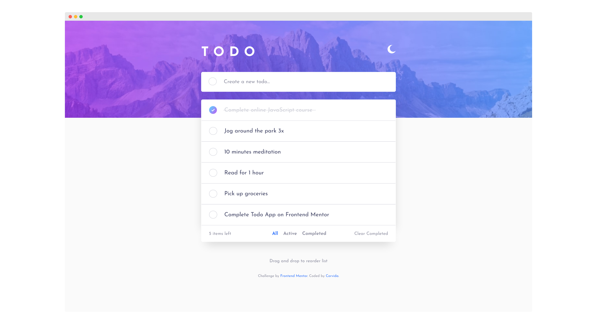

# Frontend Mentor - Todo app solution

This is a solution to the [Todo app challenge on Frontend Mentor](https://www.frontendmentor.io/challenges/todo-app-Su1_KokOW).

## Table of contents

- [Overview](#overview)
  - [The challenge](#the-challenge)
  - [Screenshot](#screenshot)
  - [Links](#links)
- [My process](#my-process)
  - [Built with](#built-with)
  - [What I learned](#what-i-learned)
  - [Continued development](#continued-development)
  - [Useful resources](#useful-resources)
- [Author](#author)

## Overview

### The challenge

Users should be able to:

- View the optimal layout for the app depending on their device's screen size
- See hover states for all interactive elements on the page
- Add new todos to the list
- Mark todos as complete
- Delete todos from the list
- Filter by all/active/complete todos
- Clear all completed todos
- Toggle light and dark mode
- **Bonus**: Drag and drop to reorder items on the list

### Screenshot

### Links

- [Solution](https://github.com/SheGeeks/Frontend-Mentor-Projects/tree/Frontend-Mentor-Projects/todo-app)
- [Live Site](https://shegeeks.github.io/Frontend-Mentor-Projects/todo-app/)

## My process

### Built with

- Mobile-first workflow
- Semantic HTML5 markup
- CSS custom properties
- Fluid Typography
- Flexbox
- JavaScript
- [Sortable](https://github.com/SortableJS/Sortable) (for drag and drop)

### What I learned

There was a lot of learning with this project. While the HTML was simple, the CSS and JS were a challenge. In fact, I did a lot of things for the first time with this project:

- Creating a custom checkbox with gradients
- Using [Sortable](https://github.com/SortableJS/Sortable) to implement drag and drop
- Creating a dark mode theme
- Using color scheme data with JS
- Changing caret color

I also got to explore the viewBox property more with the SVGs, which was fun. I took time to dig into accessibility around the inputs. Using `clamp()` was helpful to avoid adding styles to change font sizes at scale. I also added a few animations for completing tasks and deleting them, which was new for me. However, I very much want to continue digging into using CSS animations.

Overall, this was a great CSS and JavaScript challenge, exactly what I was looking for to continue building my skills in both.

### Continued development

- Improving attribute selection and structure in HTML and CSS
- CSS Animations

### Useful resources

- [Create Gradient Border Circle (StackOverFlow)](https://stackoverflow.com/questions/31388861/is-it-possible-to-create-a-gradient-border-on-a-circle-with-css3)
- [SVG viewBox (MDN)](https://developer.mozilla.org/en-US/docs/Web/SVG/Attribute/viewBox)
- [Caret Color (MDN)](https://developer.mozilla.org/en-US/docs/Web/CSS/caret-color)
- [Labeling Controls (W3)](https://www.w3.org/WAI/tutorials/forms/labels/)
- [Design An Inclusive Todo List](https://inclusive-components.design/a-todo-list/)
- [Creating A Fluid Type Scale with CSS Clamp](https://www.aleksandrhovhannisyan.com/blog/fluid-type-scale-with-css-clamp/)
- [Fluid Typography Calculator](https://royalfig.github.io/fluid-typography-calculator/)
- [Create A User Controlled Dark or Light Mode](https://piccalil.li/tutorial/create-a-user-controlled-dark-or-light-mode/)
- [Dark Modes With CSS](https://css-tricks.com/dark-modes-with-css/)

## Author

- [Portfolio](https://corvida.netlify.app/)
- [Tech Blog](https://shegeeks.net)
- [@Corvida on Twitter](https://www.twitter.com/corvida)
- [@SheGeeks on Frontend Mentor](https://www.frontendmentor.io/profile/shegeeks)
